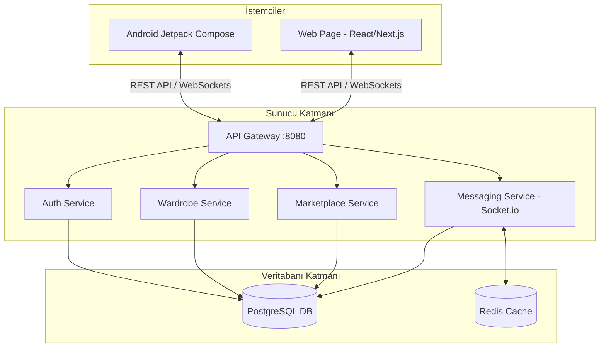

# Vesti Mobil & Web Senkronizasyon ve Geliştirme Planı

Merhaba! **Vesti** projenizin hem web uygulamasının başka bir IDE'de sorunsuzca geliştirilmesi hem de mobil uygulama ile web sayfasının **%100 senkronize ve gerçek zamanlı** çalışması için hazırladığım kapsamlı mimari planı aşağıda bulabilirsin. 

Bu doküman, projeyi başka bir IDE veya geliştiriciye devrederken ya da yeni bir projeye başlarken doğrudan kullanabileceğin bir el kitabı niteliğindedir.

---

## 1. MEVCUT DURUM ANALİZİ

Projeyi incelediğimde altyapının oldukça güçlü ve modüler tasarlandığını gördüm:
*   **Mobil Uygulama:** Yerel (Native) Android, Kotlin ve **Jetpack Compose** ile yazılmış. Retrofit (HTTP istemcisi), DataStore Preferences (token/ayarlar) ve Coil (görsel yükleme) kullanıyor.
*   **Backend (Arka Plan):** Docker ile containerize edilmiş modüler bir **Node.js (Express)** mikroservis mimarisi.
    *   `api-gateway` (Port 8080): Tüm istekleri yönlendiriyor.
    *   `auth-service` (Prisma ORM ile PostgresSQL kullanıyor).
    *   `wardrobe-service` ve `marketplace-service` (Şu anda hafızada -mock- geçici veri tutuyor, veri tabanına bağlanması gerekiyor).
    *   `messaging-service` (Socket.io kullanıyor, ancak veri tabanı kaydı yok).
    *   `ai-service`, `weather-service`, `payment-service` vb. yardımcı servisler.

Senkronizasyonu sağlamak için en kritik adımımız, hafızadaki (in-memory) verileri **ortak bir veri tabanı katmanına taşımak** ve **gerçek zamanlı iletişim protokollerini** (WebSockets) devreye almaktır.

---

## 2. VERİTABANI SEÇİMİ VE SENKRONİZASYON MİMARİSİ

Mobil ve web uygulamasının senkronize çalışmasının temel taşı, verilerin tek bir güvenilir kaynaktan (**Single Source of Truth**) gelmesi ve değişikliklerin anında her iki tarafa da bildirilmesidir.

### A. Veritabanı Seçimleri

| Veri Tipi | Seçilen Teknoloji | Neden Bu Teknoloji? |
| :--- | :--- | :--- |
| **İlişkisel Veriler** *(Kullanıcılar, Gardırop Ürünleri, İlanlar, Siparişler)* | **PostgreSQL (v15+)** | Zaten backend yapımızda (Docker-compose) mevcut. Prisma ORM ile mükemmel çalışır. ACID uyumluluğu sayesinde ödeme ve marketplace işlemleri için son derece güvenlidir. |
| **Gerçek Zamanlı Sohbet ve Mesaj Geçmişi** | **PostgreSQL + Redis** | Mesajların kalıcı depolanması için PostgreSQL kullanılırken, anlık mesaj trafiğinin hızlı yönetimi, online/offline durumları ve WebSockets oturum yönetimi için Redis (in-memory veri deposu) otomatik çalışır. |
| **Görsel Depolama (Medya)** | **Supabase Storage / AWS S3** | Kullanıcının gardırobuna yüklediği kıyafet görsellerinin mobil ve webden ortak erişilmesi gerekir. Yerel dosya sistemi yerine bulut tabanlı bir S3 uyumlu obje depolama (veya Supabase) kullanılmalıdır. |

### B. Senkronizasyon Nasıl Sağlanacak? (3 Katmanlı Yapı)

Mobil ve webin senkronizasyonunu **üç temel mekanizma** ile sağlayacağız:



1.  **RESTful API / JSON (Çift Yönlü İstek):**
    *   Kullanıcı mobil veya web üzerinden bir kıyafet eklediğinde/sildiğinde, bu istek `api-gateway` üzerinden ilgili mikroservise gider ve **PostgreSQL** veri tabanına yazılır.
    *   Mobil veya web açıldığında en güncel verileri bu API'den çeker.
2.  **WebSockets (Socket.io) - Anlık Bilgilendirme:**
    *   **Senaryo:** Kullanıcı web sayfasında açıkken mobilden yeni bir kıyafet ekledi veya mesaj aldı.
    *   **Çözüm:** Mobil uygulama veriyi yüklediğinde, backend veri tabanına yazar ve aynı anda Socket.io aracılığıyla o kullanıcının web oturumuna `"WARDROBE_UPDATED"` veya `"NEW_MESSAGE"` eventi gönderir. Web sayfası sayfayı yenilemeden arayüzü günceller.
3.  **Optimistic UI Güncellemeleri (Kullanıcı Deneyimi):**
    *   Kullanıcı "Sil" butonuna bastığı an, sunucudan yanıt gelmesini beklemeden arayüzde eleman anında silinir. Arka planda API isteği gönderilir. Hata alınırsa eleman geri getirilir. Bu teknik mobil ve webde senkronizasyon hissini kusursuzlaştırır.

---

## 3. WEB SAYFASI GELİŞTİRME PLANI (BAŞKA IDE İÇİN)

Web sayfasını geliştirecek olan geliştirici veya diğer IDE (örneğin WebStorm, VS Code) için teknik gereksinimler ve yol haritası aşağıdadır.

### A. Web Teknoloji Yığını (Tech Stack)

*   **Framework:** **Next.js (React)** - SEO dostudur, yönlendirme (routing) sistemi yerleşiktir, SSR (Server Side Rendering) yeteneği sayesinde çok hızlı açılır. (Alternatif: Hızlı ve hafif bir SPA için **Vite + React + TypeScript**).
*   **Tasarım & UI:** **Tailwind CSS + Shadcn UI**. Modern, koyu mod (dark mode) destekli, glassmorphism efektleri içeren harika bir görsel deneyim sunar.
*   **State Management (Durum Yönetimi):** **Zustand** veya **Redux Toolkit**. Kullanıcının giriş bilgileri, sepet durumu ve gardırop listesini tarayıcı hafızasında tutmak için idealdir.
*   **API İletişimi:** **Axios** (İstek kesiciler -interceptors- ile JWT yetkilendirmesi otomatik yapılır).
*   **Real-time Kütüphanesi:** **socket.io-client** (Messaging-service ile anlık haberleşme için).

### B. Web Uygulaması Sayfa Yapısı (Sitemap)

1.  **Giriş & Kayıt (/login, /register):** Mobil uygulama ile aynı veri tabanını kullandığı için mobilde açılan hesapla webden de giriş yapılabilecek (JWT Token tabanlı).
2.  **Dashboard / Anasayfa (/):** Kullanıcının gardırop özeti, hava durumuna göre kombin önerileri (AI destekli) ve güncel pazar yeri ilanları.
3.  **Dijital Gardırop (/wardrobe):** Kıyafetlerin kategorize edildiği, yeni kıyafet görsellerinin yüklendiği ve silindiği alan. (Buradaki ekleme/silmeler anında mobilde görünecek).
4.  **Pazar Yeri (/marketplace):** Kıyafet satışı yapılan veya satın alınan feed alanı. Ürün detay sayfaları ve satın alma akışı.
5.  **Mesajlaşma (/messages):** Alıcı ve satıcıların anlık sohbet ettiği arayüz (Socket.io aktif).
6.  **Profil & Ayarlar (/profile):** Kullanıcı bilgileri ve entegrasyon ayarları.

---

## 4. ADIM ADIM İŞ PAKETLERİ VE ENTEGRASYON YOL HARİTASI

Web sayfasının yazılması ve senkronizasyonun kurulması için şu adımları sırayla takip etmelisiniz:

### Faz 1: Backend Veritabanı Geçişi (En Kritik Aşama)
*   [ ] `wardrobe-service` ve `marketplace-service` içinde yer alan `in-memory` (let wardrobeItems = []) kodlarını kaldırın.
*   [ ] Bu servislerde **Prisma Client** kurulumunu yapın.
*   [ ] PostgreSQL veri tabanında `WardrobeItem` ve `MarketplaceItem` tablolarını oluşturun (Prisma şemasını güncelleyin ve `prisma db push` çalıştırın).
*   [ ] Yüklenen görselleri sunucu diski yerine ortak bir depolama servisine (örneğin Supabase Storage veya AWS S3) yükleyecek şekilde `wardrobe-service/index.js` dosyasındaki `multer` yapısını güncelleyin.

### Faz 2: Socket.io Entegrasyonu & Event Odaklı Mimari
*   [ ] `messaging-service` altındaki mesajları PostgreSQL'e kaydedecek Prisma altyapısını kurun.
*   [ ] Veri tabanına yeni bir mesaj veya gardırop verisi yazıldığında, Redis pub/sub mekanizması veya doğrudan Socket.io yardımıyla bağlı olan diğer istemciye (mobil veya web) anlık sinyal gönderin:
    ```javascript
    // Örnek: Yeni gardırop öğesi eklendiğinde web/mobile bildirme
    io.to(userId).emit('WARDROBE_CHANGED', { action: 'ADD', item: newItem });
    ```

### Faz 3: Web Projesinin Kurulması (Diğer IDE'de)
*   [ ] Diğer IDE'de yeni bir Next.js projesi başlatın: `npx create-next-app@latest vesti-web --typescript --tailwind --eslint`
*   [ ] `axios` ve `socket.io-client` paketlerini yükleyin.
*   [ ] Axios için bir base client oluşturup API Gateway adresini (`http://localhost:8080/api`) tanımlayın.
*   [ ] Yerel depolamadaki (localStorage) JWT token'ı istek başlıklarına (headers) ekleyin.

### Faz 4: Mobil Uygulama Güncellemesi
*   [ ] Android uygulamasında HTTP isteklerini yapan Retrofit servislerini doğrula (şu an zaten API Gateway'e bağlı durumdalar).
*   [ ] Android uygulamasında anlık güncellemeleri dinlemek için `socket.io-client-java` kütüphanesini ekleyin ve arka planda veri güncellemelerini dinleyen bir WebSocket servisi başlatın.

---

## 5. DİĞER IDE GELİŞTİRİCİSİ İÇİN KOPYALA-YAPIŞTIR ÇEVRESEL DEĞİŞKENLER (.ENV)

Web projesini yazacak kişinin kendi IDE'sinde oluşturması gereken `.env.local` dosyası içeriği:

```env
# Vesti Web Application Environment Variables
NEXT_PUBLIC_API_URL=http://localhost:8080/api
NEXT_PUBLIC_SOCKET_URL=http://localhost:8080
NEXT_PUBLIC_IMAGE_BASE_URL=http://localhost:8080/uploads
```

---

> [!IMPORTANT]
> **Senkronizasyon Başarısının Sırrı:** Mobil ve web taraflarında kesinlikle yerel veri tabanı (SQLite/Room veya LocalStorage) verilerini ana kaynak olarak kabul etmeyin. Yerel verileri sadece hızlı yükleme (önbellek) için kullanın. Yapılan her işlem (kıyafet ekleme, silme, mesajlaşma) önce sunucudaki PostgreSQL'e yazılmalı, sunucudan başarılı döndükten sonra veya WebSockets sinyali geldiğinde ekranlar güncellenmelidir.

Bu planı doğrudan diğer IDE'de çalışacak geliştiriciye aktarabilirsin. Kafana takılan veya detaylandırmak istediğin bir servis olursa seve seve yardımcı olurum! Dönüşünü bekliyorum dostum.
